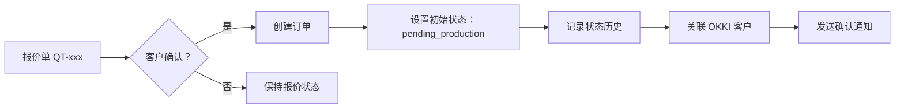

# 报价单转订单规则 (Quotation to Order Conversion)

**版本：** 1.0  
**创建日期：** 2026-04-03  
**最后更新：** 2026-04-03

---

## 📋 概述

本文档定义了从报价单 (Quotation) 转换为订单 (Order) 的业务规则、数据映射和操作流程。

---

## 🔄 转换流程



---

## 📊 数据映射规则

### 字段映射表

| 报价单字段 (Quotation) | 订单字段 (Order) | 转换规则 | 必填 |
|----------------------|-----------------|---------|------|
| `quotation_no` | `quotation_no` | 直接复制 | ✅ |
| `customer_name` | `customer_name` | 直接复制 | ✅ |
| `customer_email` | `customer_email` | 直接复制 | ✅ |
| `customer_company` | `customer_company` | 直接复制 | ❌ |
| `product_list` | `product_list` | 直接复制（JSON 数组） | ✅ |
| `quantity` | `quantity` | 直接复制 | ✅ |
| `unit_price` | `unit_price` | 直接复制 | ✅ |
| `total_amount` | `total_amount` | 直接复制 | ❌ |
| `currency` | `currency` | 直接复制 | ✅ |
| `delivery_date` | `delivery_date` | 直接复制 | ✅ |
| `shipping_address` | `shipping_address` | 展开为独立字段 | ❌ |
| `notes` | `notes` | 直接复制 | ❌ |
| - | `order_id` | 生成新 UUID 或编号 | ✅ |
| - | `status` | 固定为 `pending_production` | ✅ |
| - | `status_history` | 初始化数组，记录创建历史 | ✅ |
| - | `okki_company_id` | 通过向量检索匹配 OKKI 客户 | ❌ |
| - | `okki_order_id` | 同步到 OKKI 后回填 | ❌ |
| - | `created_at` | 当前时间戳 | ✅ |
| - | `updated_at` | 当前时间戳 | ✅ |

---

## 🎯 转换规则详解

### 1. 订单编号生成

**规则：** `ORD-YYYYMMDD-XXX`

- `ORD`: 固定前缀
- `YYYYMMDD`: 创建日期（8 位数字）
- `XXX`: 当日序号（3 位数字，从 001 开始）

**示例：**
- `ORD-20260403-001` - 2026 年 4 月 3 日第 1 个订单
- `ORD-20260403-002` - 2026 年 4 月 3 日第 2 个订单

**实现代码：**
```typescript
function generateOrderId(date: Date = new Date(), sequence: number): string {
  const dateStr = date.toISOString().slice(0, 10).replace(/-/g, '');
  const seqStr = String(sequence).padStart(3, '0');
  return `ORD-${dateStr}-${seqStr}`;
}
```

---

### 2. 状态初始化

**初始状态：** `pending_production`（待生产）

**状态历史记录：**
```json
{
  "status": "pending_production",
  "changed_at": "2026-04-03T10:00:00+08:00",
  "changed_by": "system",
  "notes": "订单由报价单 QT-20260403-001 转换创建",
  "notification_sent": false
}
```

---

### 3. OKKI 客户匹配

**匹配优先级：**

1. **域名精确匹配** ⭐
   - 从客户邮箱提取域名（如 `customer@jemglobal.com` → `jemglobal.com`）
   - 查询 OKKI 客户列表，匹配公司域名
   - 匹配成功 → 获取 `okki_company_id`

2. **公司名称模糊匹配**
   - 使用 `customer_company` 字段
   - 调用 OKKI 向量检索 API 进行语义匹配
   - 返回匹配度 > 80% 的客户

3. **手动关联**
   - 自动匹配失败时，标记为待手动关联
   - 用户在 CRM UI 中手动选择 OKKI 客户

**实现代码：**
```typescript
async function matchOkkiCompany(customerEmail: string, customerCompany: string): Promise<string | null> {
  // 1. 域名匹配
  const domain = extractDomain(customerEmail);
  const domainMatch = await okkiClient.matchByDomain(domain);
  if (domainMatch) return domainMatch.company_id;
  
  // 2. 向量检索
  const vectorResults = await okkiVectorSearch.search(customerCompany);
  if (vectorResults.score > 0.8) return vectorResults.company_id;
  
  // 3. 返回 null，等待手动关联
  return null;
}
```

---

### 4. 产品清单验证

**验证规则：**

```typescript
interface ProductValidation {
  // 必填字段检查
  required: ['sku', 'name', 'quantity', 'unit_price'];
  
  // 数量验证
  quantity: {
    type: 'integer',
    minimum: 1
  };
  
  // 价格验证
  unit_price: {
    type: 'number',
    minimum: 0
  };
  
  // SKU 验证
  sku: {
    minLength: 1,
    pattern: '^[A-Z0-9-]+$'  // 建议格式
  };
  
  // 货币验证
  currency: {
    pattern: '^[A-Z]{3}$',  // USD, CNY, EUR, etc.
    allowed: ['USD', 'CNY', 'EUR', 'GBP']  // 推荐列表
  };
}
```

---

### 5. 价格计算

**总金额计算公式：**

```typescript
// 方法 1：使用产品清单逐项计算
total_amount = product_list.reduce((sum, product) => {
  return sum + (product.quantity * product.unit_price);
}, 0);

// 方法 2：使用订单级数量和单价
total_amount = quantity * unit_price;

// 验证：两种方法结果应一致（允许 0.01 误差）
if (Math.abs(method1 - method2) > 0.01) {
  throw new Error('价格计算不一致');
}
```

---

## 📝 操作流程

### 步骤 1：确认报价单状态

```typescript
// 检查报价单是否已确认
const quotation = await getQuotation(quotationNo);
if (quotation.status !== 'confirmed') {
  throw new Error('报价单未确认，无法转换为订单');
}
```

### 步骤 2：数据验证

```typescript
// 验证必填字段
const validation = validateQuotationData(quotation);
if (!validation.valid) {
  throw new Error(`数据验证失败：${validation.errors.join(', ')}`);
}
```

### 步骤 3：生成订单编号

```typescript
const orderNo = await generateOrderNumber(new Date());
```

### 步骤 4：匹配 OKKI 客户

```typescript
const okkiCompanyId = await matchOkkiCompany(
  quotation.customer_email,
  quotation.customer_company
);
```

### 步骤 5：创建订单记录

```typescript
const order = {
  order_id: orderNo,
  quotation_no: quotation.quotation_no,
  okki_company_id: okkiCompanyId,
  customer_name: quotation.customer_name,
  customer_email: quotation.customer_email,
  customer_company: quotation.customer_company,
  product_list: quotation.product_list,
  quantity: quotation.quantity,
  unit_price: quotation.unit_price,
  total_amount: quotation.total_amount,
  currency: quotation.currency,
  delivery_date: quotation.delivery_date,
  status: 'pending_production',
  status_history: [{
    status: 'pending_production',
    changed_at: new Date().toISOString(),
    changed_by: 'system',
    notes: `订单由报价单 ${quotation.quotation_no} 转换创建`,
    notification_sent: false
  }],
  shipping_address: quotation.shipping_address,
  notes: quotation.notes,
  created_at: new Date().toISOString(),
  updated_at: new Date().toISOString()
};

await db.orders.create(order);
```

### 步骤 6：记录状态历史

```typescript
await db.order_status_history.create({
  order_id: order.order_id,
  status: 'pending_production',
  changed_by: 'system',
  notes: '订单创建',
  notification_sent: false
});
```

### 步骤 7：发送通知

```typescript
// 内部通知（销售团队）
await notifySalesTeam({
  type: 'order_created',
  order_id: order.order_id,
  quotation_no: order.quotation_no,
  customer_name: order.customer_name
});

// 客户确认邮件（可选）
if (sendCustomerConfirmation) {
  await sendOrderConfirmationEmail(order);
}
```

### 步骤 8：同步到 OKKI（可选）

```typescript
if (okkiCompanyId) {
  const okkiOrderId = await okkiClient.createOrder({
    company_id: okkiCompanyId,
    order_data: order
  });
  
  // 回填 OKKI 订单 ID
  await db.orders.update(order.order_id, {
    okki_order_id: okkiOrderId
  });
}
```

---

## 🔍 异常处理

### 异常场景列表

| 场景 | 错误码 | 处理方式 |
|------|--------|----------|
| 报价单不存在 | `QUOTATION_NOT_FOUND` | 提示用户检查报价单编号 |
| 报价单未确认 | `QUOTATION_NOT_CONFIRMED` | 引导用户先确认报价单 |
| 客户邮箱格式错误 | `INVALID_EMAIL_FORMAT` | 要求修正邮箱格式 |
| OKKI 客户匹配失败 | `OKKI_MATCH_FAILED` | 标记为待手动关联 |
| 产品清单为空 | `EMPTY_PRODUCT_LIST` | 要求至少添加一个产品 |
| 价格为负数 | `NEGATIVE_PRICE` | 要求修正价格 |
| 交期已过 | `PAST_DELIVERY_DATE` | 警告用户确认交期 |
| 订单编号重复 | `DUPLICATE_ORDER_ID` | 重新生成编号 |

---

## 📋 检查清单

在转换前，请确认以下项目：

- [ ] 报价单状态为 `confirmed`
- [ ] 客户邮箱格式正确
- [ ] 产品清单至少包含 1 个产品
- [ ] 所有产品数量和价格为正数
- [ ] 交期在未来（非过去日期）
- [ ] 货币代码为 3 位大写字母（USD/CNY/EUR/GBP）
- [ ] 收货地址完整（如需要）
- [ ] 特殊要求已在备注中说明

---

## 🔗 相关文件

- **订单 Schema:** `/schemas/order-schema.json`
- **订单状态枚举:** `/enums/order-status.ts`
- **数据库迁移:** `/db/migrations/001-create-orders-table.sql`
- **OKKI 客户匹配:** `/utils/okki-company-matcher.ts`

---

## 📊 状态流转图

```
报价单确认
    ↓
[创建订单]
    ↓
pending_production (待生产)
    ↓
in_production (生产中)
    ↓
ready_to_ship (待发货)
    ↓
shipped (已发货)
    ↓
completed (已完成)

任何时候可取消：
→ cancelled (已取消) [终态]
```

---

## 🎯 最佳实践

1. **及时转换**: 报价单确认后 24 小时内转换为订单
2. **完整信息**: 确保所有必填字段完整，减少后续修改
3. **OKKI 关联**: 尽可能自动关联 OKKI 客户，便于后续同步
4. **状态记录**: 每次状态变更都要记录历史，便于追溯
5. **通知发送**: 关键节点（创建、发货、完成）发送客户通知

---

**文档维护者:** Super Sales Agent CRM  
**审阅周期:** 每季度审阅一次
